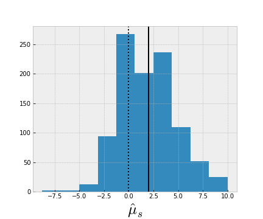

--- 
title: "PHYS-F-482: Advanced techniques in experimental physics"
author: "Juan A. Aguilar, Pascal Vanlaer"
from: markdown+emoji
jupyter: python3
format: 
    revealjs:
        #self-contained: true
        auto-stretch: true
        slide-number: true
        chalkboard: 
            buttons: false
        preview-links: auto
        html-math-method: katex
        code-overflow: wrap
        css: styles.css
        text-align: justify !important
        footer: "PHYS-F-482: Advanced techniques in experimental physics"
--- 


## Part 1: Theory of Estimators{.smaller}

#### Table of Content
* Introduction to Estimators
  * Properties
  * Examples of Estimators
* The Maximum Likelihood Method
* Variance of Estimators
* Examples of Likelihoods
  * Extended Likelihood method
  * Binned Likelihood method

:::{.callout-warning title="Disclosure"}
This slides are based on G. Cowan's [lectures](https://www.pp.rhul.ac.uk/~cowan/)
:::


## Probability Density Function {.smaller}

:::: {.columns}
::: {.column width="60%"}
A random variable (r.v.) is a numerical characteristic, quantity or object, that depends on random events. It can be _discret_ or _continuous_.
Suppose outcome of experiment is continuous value $x$:
$${\textrm{Prob}}(a < x < b) = \int_a^b f(x){\textrm{d}}x$$

:::
::: {.column width="40%"}
```{python}
#| echo: false
from IPython.display import Markdown
import matplotlib.pyplot as plt

plt.style.use('bmh')
plt.rcParams.update({'axes.labelsize': 25})
plt.rcParams.update({'legend.fontsize': 20})

#plt.rcParams.update({'figure.figsize': [8, 6]})

plt.rcParams['xtick.labelsize'] = 26
plt.rcParams['ytick.labelsize'] = 26
plt.rcParams['axes.labelsize'] = 30
plt.rcParams['xtick.major.size'] = 10
plt.rcParams['xtick.minor.size'] = 5
plt.rcParams['xtick.major.width'] = 2
plt.rcParams['xtick.minor.width'] = 1.5
plt.rcParams['xtick.major.pad'] = 8
plt.rcParams['xtick.direction'] = 'in'
plt.rcParams['ytick.major.size'] = 10
plt.rcParams['ytick.minor.size'] = 5
plt.rcParams['ytick.major.width'] = 2
plt.rcParams['ytick.minor.width'] = 1.5
plt.rcParams['ytick.major.pad'] = 8
plt.rcParams['ytick.direction'] = 'in'
plt.rcParams['legend.fontsize'] = 23
plt.rcParams['legend.title_fontsize'] = 23
#plt.rcParams['legend.frameon'] = False
plt.rcParams['axes.titlesize'] = 30
plt.rcParams['figure.titlesize'] = 30
plt.rcParams['lines.linewidth'] = 2
plt.rcParams['axes.linewidth'] = 2
plt.rcParams['font.family'] = "STIXGeneral"
from scipy.stats import norm
import numpy as np
fig, ax = plt.subplots(figsize=(5,4))
x= np.arange(-4,4,0.001)
ax.plot(x, norm.pdf(x))
ax.set_ylim(0,0.45) # range
ax.axhline(y=0.24,xmax=0.61,color='r') # horizontal line
ax.axvline(x=1, ymax=0.53, color='r',alpha=0.5) # vertical line
xplot = ax.plot([1], [0.24], marker='o', markersize=15, color="red") # coordinate point
ax.set_yticks([]) # remove y axis label
ax.set_xticks([]) # remove x axis label
ax.set_xlabel('$x$') # set x label
ax.set_ylabel('$f(x)$',rotation=0, fontsize=20) # set y label
ax.xaxis.set_label_coords(0.61, -0.02) # x label coordinate
ax.yaxis.set_label_coords(-0.1, 0.5) # y label coordinate
plt.show()
```
:::
::::

:::{.callout}
We say that $x$ follows $f(x)$ which is the probablity density function or p.d.f., which satisfies $\int_{-\infty}^{\infty} f(x) {\textrm{d}} x = 1$. This is represented as $x \sim f(x)$.

::: 

The central problem of statistics is that generally $f(x)$ is **unknown**.

## Parameter Estimation 
The parameters, $\vec{\theta}$, of a p.d.f are constants that characterize their shape. For example:

$$ f(x; \theta) = \frac{1}{\theta}\exp^{-\frac{x}{\theta}}$$

where $x$ is a r.v. and $\theta$ is a *parameter*. Sometimes the shape of $f(x)$ is known, but not its parameters.

::: {.callout title="Example"}
A nuclear decay follows an exponential law, but we don't the lifetime, $\theta = \tau$. 
:::

## Parameter Estimation {.smaller}

Suppose we have a sample of observed values $\vec{x} = (x_1,x_2, ...)$ following the $f(x;\theta)$ distribution. We want to some function of the data $\vec{x}$ that **estimates** the value of the parameter $\theta$. 

$$\widehat{\theta}(\vec{x})$$

We put a *hat*, $^$, to say that this is an **estimator**. 

:::{.callout-tip}
We sometimes call estimator to the function, and **estimate** to the value that comes out with particular data set.
:::

## Properties of Estimators {.smaller}

:::: {.columns}
::: {.column width="40%"}
* If $\widehat{\theta}$ converges to the real value $\theta$ for large number of mesurements $n$, the estimator is said to be **consistent**.
* Estimates of $\widehat{\theta}(\vec{x})$ depend on the r.v. $x$, therefore estimates are also a r.v. and they follow a specific *pdf* $g(\widehat{\theta}; \theta)$ that generally depends on the true value $\theta$.
:::
::: {.column width="60%"}
```{python}
#| echo: false
fig, ax = plt.subplots(figsize=(5,6))
x= np.arange(-4,4,0.001)
ax.plot(x, norm(0,1).pdf(x), color="blue", label="best")
ax.plot(x, norm(2,1).pdf(x), color="red", label="biased")
ax.plot(x, norm(0,2).pdf(x), color="green", label="large variance")
ax.axvline(x=0,color='k', linestyle=":")
ax.set_xlabel(r'$\hat{\theta}$') # set x label
ax.set_ylabel(r'$g(\hat{\theta};\theta=0)$') # set y label
ax.set_xlim(-4,4) # range
ax.set_ylim(0, 0.7) # range
ax.legend(loc="upper left")
plt.show()
```
:::
::::

## Properties of Estimators {.smaller}

* The **bias** of an estimator is defined as: $b = E[\widehat{\theta}] - \theta$
  * We want a small bias (systematic error). Average repeated measurements should tend to 0 bias. An estimator that has a 0 bias independent of the sample size, is called **unbiased**. An estimator that is unbiased only when $n\rightarrow\infty$ is called **asymptotically unbiased**.
* The **variance** is $V[\widehat{\theta}] = E[\widehat{\theta}^2]- (E[\widehat{\theta}])^2$
  * We also want a small variance (statistical error)


## Properties of Estimators {.smaller}

Another measure of the quality of an estimator is called the *MSE* (Mean Squared error):
$$MSE = E[(\hat{\theta}- \theta)^2] = $$
$$= E[(\hat{\theta} - E[\hat{\theta}])^2]+(E[\hat{\theta}-\theta])^2 = V[\hat{\theta}] + b^2$$

::: {.callout-warning title=""}
Small bias and variance are in general conflicting criteria. An estimator is called **optimal** if its bias is 0 and the variance is minimal. 
::: 


## Properties of Estimators {.smaller}

In summary an optimal estimator is:

* **Consistent**: $\lim_{n\rightarrow\infty}(\hat{\theta})=\theta$
* **Unbiased**: $b = 0$
* **Efficient**: It has the minimal possible variance.

:::{.callout-important}
There are not optimal estimators for most cases.
:::


## Example of an Estimator I

* Parameter: $\mu = E[x] \equiv \int x f(x)\textrm{d}x$

* Estimator: $\widehat{\mu} = \frac{1}{n}\sum_{i = 1}^n x_i \equiv \bar{x}$ 

:::{.callout-note title="Properties"}
 **Bias**: $b = E[\widehat{\mu}] - \mu = \frac{1}{n}E[x_1 + x_2 + ... + x_n] - \mu = \frac{1}{n}E[n\mu] -\mu = 0$ 
 
 **Variance**: $V[\widehat{\mu}] = V[\frac{1}{n}x_1 +  ... + \frac{1}{n}x_n] = \frac{1}{n^2}\left(V[x_1] +  ... + V[x_n]\right) = \frac{1}{n^2}(n\sigma^2) = \frac{\sigma^2}{n}$
:::

## Example of an Estimator II

* Parameter: $\sigma^2 = V[x]$
* Estimator: $\hat{\sigma}^2 = \frac{1}{(n - 1)}\sum_{i = 1}^{n}(x_i - \bar{x})^2 \equiv s^2$

:::{.callout-note title="Properties"}

 **Bias**: $b = E[\hat{\sigma}^2] - \sigma^2 = 0$ (the factor $n-1$ makes it possible, called the Bessel's correction)

 **Variance**: $V[\hat{\sigma}^2] = \frac{1}{n}(\mu_4 - \frac{n-3}{n-1}\mu_2),$ where $\mu_k = \int (x-\mu)^k f(x) {\rm d}x$
:::

## The Likelihood Function {.smaller}
Suppose a set of measurements $x_i$ each independent and identically distributed (i.i.d) ie, each follows a probability distribution $f(x;\vec{\theta})$ that depends on a set parameter $\vec{\theta}$. 

If we evaluate the function $f(x;\vec{\theta})$ with the data $x_i$ obtained and regard it as a function of the parameters $\vec{\theta}$ this is called the **likelihood function**:

$$\mathcal{L}(\vec{\theta}) = f(\vec{x};\vec{\theta}) = \prod_{i=1}^n f(x_i;\vec{\theta}),$$

where $x_i$ are considered as constants

## The Maximum Likelihood Method{.smaller}

The likelihood function is a function of $\vec{\theta}$. If we choose a set of $\vec{\theta}$ *close to the true value*, the observed data will is the most probable under the the assume statistical model and the likelihood will be at its maximum. So we can define the **maximum likelihood estimators (MLE)** to be the parameters that maximize the likelihood. If the likelihood function is differentiable the estimators are given by the condition:

$$ \left. \frac{\partial \mathcal{L}}{\partial \theta_i}\right|_{\theta_i = \hat{\theta}_i} = 0$$


:::{.callout-note title="MLE efficiency theorem"}
The MLE efficiency theorem states that a MLE will be unbiased and efficient if an unbiased estimator extist. (Proof note discussed here)
:::

## Maximum Likelihood Method
:::{.callout}
### Example I

Consider the decay time of a particle, which is given by the exponential *pdf*: $f(t; \tau) = \frac{1}{\tau}e^{-{t/\tau}}$ where $\tau$ is the lifetime of the particle. 
Imagine we have a set of measurements for different decay times, $t_1, ..., t_n$, the likelihood would be:
$$\mathcal{L}(\tau) = \prod_{i =1 }^n \frac{1}{\tau}e^{-\frac{t_i}{\tau}}$$
:::

## Maximum Likelihood Estimators 

:::{.callout}
### Example I
The value of $\tau$ for which $\mathcal{L}(\tau)$ is maximum also gives the maximum value of its natural logarithm (the so-called log-likelihood function):

$$\ln \mathcal{L}(\tau)  = \sum_{i =1 }^n \ln \frac{1}{\tau}e^{-\frac{t_i}{\tau}}  = \sum_{i =1 }^n \left(\ln{\frac{1}{n}} - \frac{t_i}{\tau}\right)$$


Finding the maximum $\frac{\partial \ln \mathcal{L}(\tau)}{\partial\tau} = 0$ gives:
$$ \widehat{\tau} = \frac{1}{n}\sum_{i=1}^n t_i$$
:::

## Maximum Likelihood Estimators {.smaller}

```{python}
#| echo: true
#| output-location: column

import numpy as np
import scipy as sp
from scipy import special
from scipy.stats import expon

import matplotlib.pylab as plt
plt.style.use('bmh')
plt.rcParams.update({'axes.labelsize': 25})
plt.rcParams.update({'legend.fontsize': 20})
true_tau  = 1.
x = np.linspace(0, 10, 1000)
nevents = 50
np.random.seed(1234)
decay_data = np.random.exponential(true_tau, nevents)
fig, ax = plt.subplots(figsize=(5,5)) 
ax.scatter(decay_data, np.zeros(nevents), 
            s = 500, marker = '|') 
ax.plot(x, expon(0,true_tau).pdf(x), lw=2, color="red")
ax.set_xlim(0,5)
ax.set_ylim(0,1)
ax.set_xlabel("$t$")
ax.set_ylabel("$y$")
plt.show()
tau_estimate =  1./nevents * np.sum(decay_data)
print (f"The MLE for tau is: {tau_estimate:.2f}")
```


## Maximum Likelihood Estimator
:::{.callout}

### Example II
Let's consider the case of a gaussian distribution:
$$f(x;\mu, \sigma^2) = \frac{1}{\sqrt{2\pi\sigma^2}} e^{-(x-\mu)^2/2\sigma^2}$$
If we have $x_1,...,x_n$ independent randon variables that follow the gaussian distribution, the log-likelihood is given by:
$$\ln \mathcal{L}(\mu, \sigma^2) = \sum_{i=1}^n \ln f(x_i;\mu,\sigma^2) = \sum_{i=1}\left(\ln\frac{1}{\sqrt{2\pi}}+ \frac{1}{2}\ln\frac{1}{\sigma^2}- \frac{(x_i - \mu)^2}{2\sigma^2}\right)$$
:::

## Maximum Likelihood Estimator 
:::{.callout}
### Example II

Calculating the derivatives for $\mu$ and $\sigma^2$ we have:
$$\widehat{\mu} = \frac{1}{n}\sum_{i=1}^n x_i$$
and
$$\widehat{\sigma^2}= \frac{1}{n}\sum_{i=1}^n(x_i- \mu)^2$$
:::

## Maximum Likelihood Estimator {.smaller}
### Properties of MLE
* The MLE $\hat{\mu}$ is unbiased. 
* The MLE $\widehat{\sigma^2}$ is also unbiased but it requires a known value of $\mu$. Using the ML estimator $\hat{\mu}$ instead, makes $\widehat{\sigma^2}$ biased! since $E[\widehat{\sigma^2}] = \frac{n - 1}{n}\sigma^2$. It is always asymptotically unbiased (ie when $n \rightarrow \infty$) To have an unbiased estimator we need to add the Bessel's correction and use:
  $$ s^2 = \frac{1}{n - 1}\sum_{i=1}^n(x_i- \hat{\mu})^2$$

## Functions of MLE {.smaller}

Let's come back to the decay of a particle, imagine we wrote it as function of the decay constant $\lambda = \frac{1}{\tau}$:
$$f(t;\lambda) = \lambda e^{-\lambda t}$$
* The ML estimator of a function is simply $\hat{\alpha}(\theta) = \alpha(\hat{\theta})$ in this case:
  $$ \hat{\lambda} = \frac{n}{\sum_{i=1}^n t_i}$$

:::{.callout-warning title="Caveat"}
There is a caveat now, which is that $\hat{\lambda}$ is now a **biased** estimator:
  $$ E[\hat{\lambda}]= \lambda \frac{n}{n-1}$$ 
  Is still asymtotically unbiased, ie, bias goes to 0 when $n\rightarrow \infty$
:::

## Variance of Estimators {.smaller}
Estimators depend on a **sample of data**, which are outcomes of random variables, therefore estimators differ everytime we take different data. In other words, estimators are also random variable. Once we have defined the estimators, we want to report its _statistical error_. I.e., how widely the estimate will distribute if we repeat the measurement many times. We are going to see 4 methods:

1. Analytical (when possible)
2. Monte Carlo Method
3. Using the Information Inequality
4. Graphical Method

## Variance of Estimators {.smaller}
### Analytical Method 
In some cases we can calculate the variance analytically. For example for the exponential distribution. We found the estimator as:  $\widehat{\tau} = \frac{1}{n}\sum_{i=1}^n t_i$. Variance is defined as: 

$$V[\widehat{\tau}] = E[\widehat{\tau}^2] - (E[\widehat{\tau}])^2 = \int...\int\left(\frac{1}{n}\sum_{i=1}^n t_i\right)^2\frac{1}{\tau}e^{-t_1/\tau}...\frac{1}{\tau}e^{-t_n/\tau} {\rm d}t_1...{\rm d}t_n - $$
$$ - \left(\int...\int\left(\frac{1}{n}\sum_{i=1}^n t_i\right)\frac{1}{\tau}e^{-t_1/\tau}...\frac{1}{\tau}e^{-t_n/\tau} {\rm d}t_1...{\rm d}t_n\right)^2 = \frac{\tau^2}{n}$$

:::{.callout-caution}
  Note that the variance depends on $\tau$ the __true value__. In practice we take $\widehat{\tau}$ as the value for the variance. In our example with 50 events we have:  $\widehat{\sigma}_{\widehat{\tau}} = \sqrt{V[\widehat{\tau}]} = \sqrt{\widehat{\tau}^2/n} = 0.15$
:::

## Variance of Estimators {.smaller}
### Monte Carlo Method
The M.L. estimate, $\hat{\theta}$, depends on randomly distributed variables, $x_1,...,x_n$, therefore it also a *random variable*. Since it depends on a large number of random variables, the **Central Limit Theorem** says that $\hat{\theta}$ should follow a gaussian distribution with the true, $\theta$, as central value (for an unbiased estimator):
$$g(\widehat{\theta};\theta)=\frac{1}{\sqrt{2\pi\sigma^2_{\widehat{\theta}}}}e^{-\frac{1}{2}\frac{(\widehat{\theta}-{\theta})^2}{\sigma^2_{\widehat{\theta}}}} $$
$$\rightarrow \ln (g(\hat{\theta};\theta))= -\frac{1}{2}\frac{(\hat{\theta}-{\theta})^2}{\sigma^2_{\widehat{\theta}}} - \frac{1}{2}\ln(2\pi\sigma^2_{\widehat{\theta}})$$


## Variance of Estimators  {.smaller}
### Monte Carlo Method
In several cases, we cannot calculate the variance analytically we can use the fact that $\hat{\theta}$ should follow a gaussian distribution by using Monte Carlo. In this example Here we repeat 1000 experiments with 50 measurements each (`nevents = 50`) :
```{python}
#| echo: true
nexperiments = 1000
tau_estimates = []
for i in range(0, nexperiments):
   d = np.random.exponential(tau_estimate, nevents)
   tau_estimates.append(1./nevents * np.sum(d))
```

:::{.callout-warning}
Note that we used $\hat{\tau}$ to generate the pseudo-samples since we don't have access to the true $\tau$.
:::


## Variance of Estimators {.smaller}
### Monte Carlo Method
```{python}
#| echo: true
#| output-location: column

fig, ax2 = plt.subplots(figsize=(4,4)) 
ax2.hist(tau_estimates, bins = 20)
ax2.set_xlim(0, 2)
ax2.set_xlabel(r"$\hat{\tau}$")
ax2.set_ylabel("$N_{experiments}$")
plt.show()
var = np.var(tau_estimates)

print (f"Variance estimate is {var:.2f}")
```

Based on the results of the Monte Carlo we can infer the variance of the distribution.

## Variance of Estimators {.smaller}
### The Rao-Cramer-Frechet Limit
Sometimes it might be too difficult to compute the variances analytically, and a Monte Carlo study usually involves a significant amount of work. In these cases we can use the _information inequality_ (RCF) which sets a lower bound on the variance of any estimator (not only ML):

$$V[\hat{\theta}] \geq \frac{\left(1+\frac{\partial b}{\partial \theta}\right)^2}{E\left[-\frac{\partial^2 \ln \mathcal{L}}{\partial \theta^2}\right]}$$

where $b$ is the bias $(b = E[\hat{\theta} - \theta])$

:::{.callout-tip}
 A proof of this relation can be found in _S. Brandt, Datenanalyse, 3rd edition, BI-Wissenschaftsverlag, Mannheim (1992); Statistical and Computational Methods in Data Analysis, Springer, New York (1997)._
:::

## Variance of Estimators {.smaller}
### The Rao-Cramer-Frechet Limit

This is the **Minimum Variance Bound** or **Cramer-Rao Bound**. For unbiased estimators ($b =0$) we have:
$$V[\hat{\theta}] \geq  \frac{1}{E\left[-\frac{\partial^2 \ln \mathcal{L}}{\partial \theta^2}\right]} = \frac{1}{\mathcal{I}(\theta)}$$

where $\mathcal{I}(\theta) = - E\left[\frac{\partial^2 \ln \mathcal{L}}{\partial \theta^2}\right]$ is the **Fisher information**

## Variance of Estimators {.smaller}
### The Rao-Cramer-Frechet Limit 

In the large sample limit for ML estimators, the inequality becomes an equality, and for the case of more parameters $\vec{\theta} = (\theta_1,...,\theta_n)$, the covariance matrix of their estimators, $V_{ij}$ is given by:
$$(V^{-1})_{ij} = E\left[-\frac{\partial^2\ln\mathcal{L}}{\partial\theta_i\partial\theta_j}\right] = -\int f(x;\vec{\theta})\frac{\partial^2\ln f(x;\vec{\theta})}{\partial\theta_i\partial\theta_j} \textrm{d}x$$

## Variance of Estimators 
### The Rao-Cramer-Frechet Limit

It is impractical, in many instances, to calculate the RCF bound instead we can estimate it as:

$$(\widehat{V^{-1}})_{ij} = -\frac{\partial^2\ln\mathcal{L}}{\partial\theta_i\partial\theta_j}\Bigr|_{\vec{\theta}=\hat{\vec{\theta}}} $$

which for one parameter becomes:

$$\widehat{\sigma^2_{\hat{\theta}}} = \left(-1\Bigr/\frac{\partial^2\ln\mathcal{L}}{\partial\theta^2}\right)\Bigr|_{\theta=\hat{\theta}} $$

## Variance of Estimators 
### The Rao-Cramer-Frechet Limit

:::{.callout-important}
If we don't have access to the analytical expression of the likelihood function, we can use numerical tools like `iminuit` to numerically estimate the curvature of the likelihood function and estimate the double derivative

Also note that the RCF method assumes the estimator has the minimum variance. This is true for MLE, but not generally true, your estimator of choice might have a larger variance.
:::


## Variance of Estimators{.smaller}
### The Graphic Method 
The graphic method is an extension of the RCF limit and it consists on evaluating the shape of the likelihood around its maximumy. We can expand the likelihood as a [Taylor expansion](https://en.wikipedia.org/wiki/Taylor_series) around its maximum as:

$$\ln {\mathcal{L}(\theta)} = \ln {\mathcal{L}(\hat{\theta})} + \left[\frac{\partial \ln \mathcal{L}}{\partial \theta}\right]_{\theta = \hat{\theta}}(\theta - \hat{\theta}) + \frac{1}{2}\left[\frac{\partial^2 \ln \mathcal{L}}{\partial \theta^2}\right]_{\theta = \hat{\theta}}(\theta - \hat{\theta})^2 + ...$$
where by definition $\ln {\mathcal{L}(\hat{\theta})} = \ln \mathcal{L}_{max}$. Also the first derivative is 0, since it's evaluted at its maximum so ingnoring larger terms we have:
 $$ \ln {\mathcal{L}(\theta)} = \ln \mathcal{L}_{max} - \frac{(\theta - \hat{\theta})^2}{2 \widehat{\sigma_{\widehat{\theta}}^2}} \rightarrow \ln \mathcal{L}(\hat{\theta} \pm \widehat{\sigma_{\hat{\theta}}}) =\ln \mathcal{L}_{max} - \frac{1}{2}$$ 


## Variance of Estimators{.smaller}
### The Graphic Method 
:::: {.columns}
::: {.column width="40%"}


* By moving away one unit of $\pm \hat{\sigma}_{\hat{\theta}}$ the likelihood is $-1/2$ from the maximum.
* Notice that *at large sample limit* $\mathcal{L}(\theta)$ has a gaussian shape around its maximum, which gives a parabola in $\ln\mathcal{L}(\theta)$
* On the right we have our example of the decay time. Notice that the $\ln\mathcal{L}$ is not a complete parabola.
:::
::: {.column width="60%"}

```{python}
#| echo: false

def llh(tau):
    likelihood = np.sum(np.log(expon(0, tau).pdf(decay_data)))
    return likelihood

l = []
taus = np.arange(0.5, 1.6, 0.01)
for t in taus:
    l.append(llh(t))

fig, ax3 = plt.subplots(figsize=(6,5)) 
ax3.set_facecolor("white")
ax3.set_xlabel(r"$\tau$")
ax3.set_ylabel(r"$\ln \mathcal{L}(\tau)$")
ax3.axhline(y=np.max(l)-0.5, linestyle=":", color="black")
ax3.axhline(y=np.max(l), linestyle=":", color="black")
ax3.set_ylim(np.max(l)-2, np.max(l)+0.5)
ax3.axvline(x=tau_estimate, linestyle=":", color="black")

mask = np.argwhere(np.diff(np.sign(l - (np.max(l) - 0.5)) )).flatten()

tmin = taus[mask][0]
tmax = taus[mask][1]

ax3.axvline(x=tmin, linestyle="-", color="black")
ax3.axvline(x=tmax, linestyle="-", color="black")
ax3.set_xlim(0.4, 1.8)
ax3.plot(taus, l, lw=5)
ax3.text(tau_estimate + 2* 0.2, np.max(l) - 0.5, r'$\ln \mathcal{L}_{max} - \frac{1}{2}$', fontsize=20, va='center', ha='center', backgroundcolor='w')
ax3.text(tau_estimate + 2* 0.2, np.max(l), '$\ln \mathcal{L}_{max}$', fontsize=20, va='center', ha='center', backgroundcolor='w')
ax3.text(tmin-0.1, np.max(l)+0.3, r'$\hat{\tau} + \Delta \hat{\tau}_{-}$', fontsize=20, va='center', ha='center', backgroundcolor='w')
ax3.text(tmax+0.1, np.max(l)+0.3, r'$\hat{\tau} - \Delta \hat{\tau}_{+}$', fontsize=20, va='center', ha='center', backgroundcolor='w')
ax3.text(tau_estimate, np.max(l)+0.3, r'$\hat{\tau}$', fontsize=20, va='center', ha='center', backgroundcolor='w')
fig.savefig("./figs/tau_variance_graph.png")
plt.show()
```
:::
::::


## Variance of Estimators 
### The Graphic Method

In this case the likelihood is not completely parabolic (not enough data), but we can approximately give a value for the estimate of the variance: 

```{python}
print (f"Error tmin = {tau_estimate - tmin:.2f}")
print (f"Error tmax = {tmax - tau_estimate:.2f}")
print (f"Approx error = {(tmax - tmin)/2:.2f}")
```


## Variance of Estimators {.smaller}
:::{.callout title="A note on the relationship between $\mathcal{L}(\theta)$ and $g(\hat{\theta};\theta)$"}
We saw that the estimate $\hat{\theta}$, being a r.v., follows a $g(\hat{\theta};\theta)$ distribution which according to the Central Limit Theorem should follow a Gaussian distribution with a given variance $\sigma_{\hat{\theta}}$.  On the other hand, that the likelihood can also be approximate by a gaussian, so we can write:
$$\ln {\mathcal{L}(\theta)} = \ln \mathcal{L}_{max} - \frac{(\theta - \widehat{\theta})^2}{2 \sigma_{\theta}^2}$$
In other words, the likelihood is also a gaussian but in the $\theta$ space, not in the $\widehat{\theta}$ space as $g(\hat{\theta};\theta)$. 
However the RCF and the Taylor expansion showed, together with the symmetry between $(\theta - \widehat{\theta})^2$ and $(\widehat{\theta} - \theta)^2$, that the variance of the likelihood function is the same as the one $g(\widehat{\theta};\theta)$, i.e. ${\sigma_{\widehat{\theta}}} = \sigma_{\theta}$.

Both the distribution $g(\widehat{\theta}; \theta)$ and the likelihood $\mathcal{L}(\theta)$ have the **same variance**. 
:::

## Variance of Estimators{.smaller}
### Two correlated estimates

::::{.columns}
:::{.column width="50%"}

Let's study one case in which we have two correlated estimates. Consider the case of a scattering process where we measure the scattering angle, $x = \cos\theta$, which follows the distribution:
$$ f(x;\alpha, \beta) = \frac{1 + \alpha x + \beta x^2}{2 + 2\beta/3}$$

On the right we have simulated 1000 events following this distribution.

:::
:::{.column width="50%"}

```{python}
#| echo: false

from scipy.stats import rv_continuous
class angle_dist(rv_continuous):
  def __init__(self, alpha, beta, *args, **kwargs):
    super().__init__(*args, **kwargs)
    self.alpha = alpha
    self.beta = beta

  def _pdf(self, x):
    return (1 + self.alpha*x + self.beta*x**2)/(2 + 2 * self.beta/3)

generator = angle_dist(0.5, 0.5, 0, -1, 1)

data = generator.rvs(size=1000)
fig, ax = plt.subplots(figsize=(4,4)) 

ax.hist(data)
ax.set_xlim(-1,1)
ax.set_xlabel(r"$\cos(\theta)$")
plt.show()


def model(data: np.array, alpha: float, beta: float) -> np.array:
  return (1 + alpha*data + beta*data**2)/(2 + 2 * beta/3)

def UnbinnedNLL(data: np.array, args: tuple) -> float:
  values = np.log(model(data, args[0], args[1]))
  return -np.sum(values)

import iminuit

def funcU(args: tuple) -> float:
    return UnbinnedNLL(data, tuple(args))

m = iminuit.Minuit(funcU, (0.5,0.5), name=("α","β"))
m.errordef = iminuit.Minuit.LIKELIHOOD #This tells iminuit that the cost function is a negative log-likelihood    
m.migrad()
m.hesse()

L = []
alpha_grid = np.linspace(0, 1, 100)
beta_grid = np.linspace(0, 1, 100)

for alpha in alpha_grid:
    La = []
    for beta in beta_grid:
        La.append(UnbinnedNLL(data, (alpha, beta)))
    L.append(La)

L = np.array(L)
i_best = np.where(L == L.min())
from argparse import Namespace

fitted_scan = Namespace(alpha = alpha_grid[i_best[0]], beta = beta_grid[i_best[1]])
fitted = Namespace(alpha = m.values[0], beta = m.values[1])

#print (m.values)
#print (m.covariance[0,1])
#print (m.covariance[1,0])

```
:::
::::

## Variance of Estimators {.smaller}
### Two correlated estimates
We will show that the different estimates, $\hat{\alpha}, \hat{\beta}$ are correlated. In this case, for large $n$, the likelihood takes the gaussian approximation:

$$\mathcal{L}(\alpha, \beta) \approx \frac{1}{\sqrt{1-\rho^2}} \frac{1}{2\pi\sqrt{\sigma^2_{\hat{\alpha}}\sigma^2_{\hat{\beta}}}}e^{-\frac{1}{2(1-\rho^2)}\left[\frac{(\alpha-\hat{\alpha})^2}{\sigma^2_{\hat{\alpha}}}+\frac{(\beta-\hat{\beta})^2}{\sigma^2_{\hat{\beta}}}-2\rho\frac{(\alpha-\hat{\alpha})}{\sigma_{\hat{\alpha}}}\frac{(\beta-\hat{\beta})}{\sigma_{\hat{\beta}}}\right]}$$

In this case, the condition, $\ln \mathcal{L} (\alpha, \beta) = \ln \mathcal{L}_{max} - 1/2$, is now an **ellipse**, and the angle of the ellipse, $\phi$, is given by the correlation between the two estimates:
$$\tan 2\phi = \frac{2\rho{\sigma}_{\hat{\alpha}}{\sigma}_{\hat{\beta}}}{{\sigma}^2_{\hat{\alpha}} - {\sigma}^2_{\hat{\beta}}}$$


## Variance of Estimators {.smaller}
### Two correlated estimates

We can also calculate the covariance using the RCF approximation:
$$(\widehat{V^{-1}})_{ij} = -\frac{\partial^2\ln\mathcal{L}}{\partial\theta_i\partial\theta_j}\Bigr|_{\vec{\theta}=\hat{\vec{\theta}}} $$

We are going to use `iminuit` to estimate the double derivatives of the likelihood, which give us the following covariance matrix:

```{python}
m.covariance
```

## Variance of Estimators{.smaller}
### Two correlated estimates

::::{.columns}
:::{.column width="50%"}

We are going to plot the likelihood function and the ellipse using the covariance matrix given by `iminuit`

The parallel lines represent the standard deviation of each of the individual estimators.


:::{.callout-note}
Correlations between estimators result in an increase of their standard deviations. 
:::

:::
:::{.column width="50%"}
```{python}
#| output-location: column
from matplotlib.patches import Ellipse
import matplotlib.transforms as transforms

s_alpha = np.sqrt(m.covariance[0,0])
s_beta = np.sqrt(m.covariance[1,1])
rho = np.sqrt(m.covariance[1,0])

pearson = m.covariance[0, 1]/np.sqrt(m.covariance[0, 0] * m.covariance[1, 1])

ell_radius_x = np.sqrt(1 - pearson)
ell_radius_y = np.sqrt(1 + pearson)
ellipse = Ellipse((0, 0), width=ell_radius_x * 2, height=ell_radius_y * 2,
                facecolor="None", lw=2, edgecolor='white')

fig1, ax1 = plt.subplots(figsize=(5,5))

scale_x = np.sqrt(m.covariance[1, 1])
mean_x = fitted.beta
# calculating the standard deviation of y ...
scale_y = np.sqrt(m.covariance[0, 0]) 
mean_y = fitted.alpha

transf = transforms.Affine2D() \
        .rotate_deg(-45) \
        .scale(scale_x, scale_y) \
        .translate(mean_x, mean_y)

ellipse.set_transform(transf + ax1.transData)

import matplotlib.colors as colors
mesh = ax1.pcolormesh(alpha_grid, beta_grid, L, shading="auto", vmin = L.min(), vmax = L.min()+6)
ax1.add_patch(ellipse)
plt.scatter(fitted.beta, fitted.alpha, 100, 
    marker='o',color='w', label="Estimated")
plt.scatter(0.5, 0.5, 200,
    marker='+',color='r', label="Truth")
cbar = plt.colorbar(mesh)
cbar.ax.set_ylabel('-$\ln \mathcal{L}$')
plt.legend()
plt.axvline(x=fitted.beta + s_beta, color="w", linestyle=":")
plt.axvline(x=fitted.beta - s_beta, color="w", linestyle=":")
plt.axhline(y=fitted.alpha + s_alpha, color="w", linestyle=":")
plt.axhline(y=fitted.alpha - s_alpha, color="w", linestyle=":")
plt.xlabel(r'$\beta$')
plt.ylabel(r'$\alpha$')
plt.xlim(fitted.beta - 3*s_beta, fitted.beta + 3*s_beta)
plt.ylim(fitted.alpha - 3*s_alpha, fitted.alpha + 3*s_alpha)
plt.show()
```

:::
::::


## Extended Maximum Likelihood 
Sometimes the total number of events in a sample is a fixed number, others $n$ is also a random variable. 

:::{.callout title="Example 1"}
For the muon life time, you can decide to run you experiment until you always get $n$ number of triggers, since you only care about the $\Delta t$. 
:::
:::{.callout title="Example 2"}
You look for a rare physics event (like a desintegration) and you measure the number of events $n$ in fixed time window.
:::

## Extended Maximum Likelihood {.smaller}

In these cases, $n$ is often a Poisson random variable with mean $\nu$. The results of an experiment will be then: $n$, $x_1$, ..., $x_n$. The extended likelihood is defined as:

$$\mathcal{L}(\nu, \vec{\theta}) = \frac{\nu^n}{n!}e^{-\nu}
\prod_{i=1}^nf(x_i;\vec{\theta})$$

We have now 2 options:

1. The expected number of events depends on the unknown parameters $\vec{\theta}$, i.e. $\nu = \nu(\vec{\theta})$.

2. The two, $\nu$ and $\vec{\theta}$ are independent.

## Extended Maximum Likelihood 

Suppose a theory gives $\nu = \nu(\vec{\theta})$ then the log-likelihood can be written as:
$$\ln {\mathcal{L}(\vec{\theta})} = -\nu(\vec{\theta}) + \sum_{i=1}^n \ln (\nu(\vec{\theta})f(x_i;\vec{\theta})) + C $$

:::{.callout title="Example"}
A process where the number of events depends on the cross-section $\sigma_{xs}(\vec{\theta})$ predicted as function of the parameters of the theory, $\vec{\theta}$ that also dictate the shape of the distribution of events $x_i$.
:::

## Extended Maximum Likelihood  {.smaller}

In case $\nu$ and $\vec{\theta}$ are independent we can find the estimator $\widehat{\vec{\theta}}$ by maximizing ($\partial/\partial\vec{\theta}$):

$$\ln {\mathcal{L}(\vec{\theta})} = n\ln \nu -\nu + \sum_{i=1}^n \ln f(x_i;\vec{\theta}) + C $$

$$\frac{\partial \ln {\mathcal{L}(\vec{\theta})}}{\partial \theta_i}\Bigr|_{\theta_i = \hat{\theta}_i} = 0$$

likewise the estimator $\hat{\nu}$ can be find by maximizing over $\nu$:
$$\frac{\partial \ln {\mathcal{L}(\vec{\theta})}}{\partial \nu} \Bigr|_{\nu = \hat{\nu}} = 0 = \frac{n}{\hat{\nu}} - 1 \rightarrow \hat
{\nu} = n$$ 

:::{.callout-tip}
In the case of that $\nu$ does not depend on $\vec{\theta}$, the extended ML gives the same result for $\vec{\theta}$ as the normal ML, and $\hat{\nu} = n$
:::

## Extended Maximum Likelihood {.smaller}
Let's assume a sample mixed with two types of events, a signal that follows a known distribution $f_s(x)$ and background events distributed as $f_b(x)$. We defined:

* signal fraction $= \theta$.
* expected number of events $= \nu$.
* observed number of events $= n$.
* expected number of signal events $\mu_s= \theta \nu$
* expected number of background events $\mu_b = (1-\theta)\nu$

The goal is to estimate $\mu_s$ and $\mu_b$. The overall dsitribution of events can be defined as:

$$f(x; \mu_s, \mu_b) = \frac{\mu_s}{\mu_s + \mu_b}f_s(x)+\frac{\mu_b}{\mu_s + \mu_b}f_b(x)$$

## Extended Maximum Likelihood {.smaller}
The observed number of events will follow a Poisson distribution as:
$$P(n; \mu_s,\mu_b) = \frac{(\mu_s + \mu_b)^n}{n!}e^{-(\mu_s + \mu_b)}$$
The likelihood can be written as:

$$\ln \mathcal{L}(\mu_s,\mu_b) = - (\mu_s + \mu_b) +\sum_{i= 1}^n\ln[(\mu_s + \mu_b)f(x_i;\mu_s, \mu_b)]$$

which becomes:

$$\ln \mathcal{L}(\mu_s,\mu_b) = - (\mu_s + \mu_b) +\sum_{i= 1}^n\ln[\mu_s f_s(x_i) + \mu_b f_b(x_i)]$$

## Extended Maximum Likelihood {.smaller}

Let's generate a sample of with defined distributions for background and signal

```{python}
#| echo: true
from argparse import Namespace

truth = Namespace(mu_s = 30, mu_b = 100, tau = 3, mu = 1.5, sigma = 0.1)
bg_events = np.random.poisson(truth.mu_s)
background = np.random.exponential(truth.tau, bg_events)
sig_events = np.random.poisson(truth.mu_b)
mu = 1.5
sigma = 0.1
signal = np.random.normal(truth.mu, truth.sigma, sig_events)

ntotal = len(signal)+len(background)
print(ntotal)


print (truth)
```

## Extended Maximum Likelihood {.smaller}

We can plot the sample and the distributions as:

```{python}
#| echo: true
#| output-location: column

from scipy.stats import expon
from scipy.stats import norm

fig, ax = plt.subplots(figsize=(6,4)) 

sample = np.concatenate([background, signal])
ax.scatter(sample, 
np.zeros(bg_events + sig_events), 
        s = 500, marker = '|') 
ax.plot(x, truth.mu_b*expon(0,truth.tau).pdf(x), 
        lw=2, linestyle=":", color="black")
ax.plot(x, truth.mu_s*norm(truth.mu, truth.sigma).pdf(x), 
        lw=2, color="blue")
ax.plot(x, truth.mu_b * expon(0,truth.tau).pdf(x) 
        + truth.mu_s*norm(truth.mu, truth.sigma).pdf(x), 
        lw=2, color="black")

ax.set_xlim(0,3)
ax.set_ylim(0,ntotal)
ax.set_xlabel("$x$")
ax.set_ylabel("$y$")
plt.show()
```

## Extended Maximum Likelihood 

We can now define the $-\ln{\mathcal{L}}$ and find its minima:

```{python}
#| echo: true
def likelihood(mu_s, mu_b, sample):
    values = np.log(mu_s * norm(truth.mu, truth.sigma).pdf(sample) 
          + mu_b * expon(0, truth.tau).pdf(sample), 
          where= mu_s * norm(truth.mu, truth.sigma).pdf(sample) 
          + mu_b * expon(0, truth.tau).pdf(sample)>0)
    return (mu_s + mu_b) - np.sum(values)
```

## Extended Maximum Likelihood {.smaller}

```{python}
#| echo: true 
L = []
mu_s_grid = np.linspace(0, 100, 40)
mu_b_grid = np.linspace(0, 300, 40)

for mus in mu_s_grid:
    Ls = []
    for mub in mu_b_grid:
        Ls.append(likelihood(mus, mub, sample))
    L.append(Ls)

L = np.array(L)
i_best = np.where(L == L.min())
print (i_best)
fitted = Namespace(mu_s = mu_s_grid[i_best[0]], mu_b = mu_b_grid[i_best[1]])
print (f"Signal estimate {fitted.mu_s}")
print (f"Background estimate {fitted.mu_b}")
```

## Extended Maximum Likelihood {.smaller}

```{python}
#| echo: true
#| output-location: column
import matplotlib.colors as colors
fig1, ax1 = plt.subplots(figsize=(5,5))
mesh = ax1.pcolormesh(mu_b_grid, mu_s_grid, L, 
    shading="auto", vmin = L.min(), 
    vmax = L.min()+1000)
cs = ax1.contour(mu_b_grid, mu_s_grid, L, 
    [L.min() + 0.5, L.min() + 4./2., L.min() 
    + 9./2.],colors='white')
fmt = {}
strs = ['1$\sigma$', '2$\sigma$', '3$\sigma$']
for l, s in zip(cs.levels, strs):
    fmt[l] = s
plt.clabel(cs, cs.levels, inline=1, 
    fmt=fmt, fontsize=20)
plt.scatter(fitted.mu_b, fitted.mu_s, 
    marker='o',color='w', label="Estimated")
plt.scatter(truth.mu_b, truth.mu_s, 
    marker='+',color='r', label="Truth")
cbar = plt.colorbar(mesh)
cbar.ax.set_ylabel('-$\ln \mathcal{L}$')
plt.legend()
plt.xlabel('$\mu_b$')
plt.ylabel('$\mu_s$')
plt.xlim(0, 150)
plt.ylim(0, 50) 
```

 
## Extended Maximum Likelihood {.smaller}

* Sometimes a downward fluctuation of the background in the signal region can result in a *negative* signal estimate $\hat{\mu}_s$. 
* We can let that happen as long as the total *pdf* $f(x; \hat{\mu}_s, \hat{\mu}_b) > 0$, i.e. remains positive everywhere. 
* Example made with $\mu_s$ = 2.5

{fig-align="center"}

 
## Binned Maximum Likelihood {.smaller}
* When data is large, using the individual events might be very CPU consuming. In this case it is better to use histrograms. 
* The number of events in the bin-$i$ based on the unknown parameters, $\vec{\theta}$ is:
  $$\nu(\vec{\theta})_i = n_{tot}\int_{x^i_{min}}^{x^i_{max}}f(x;\vec{\theta}){\rm d}x$$ 
  where $x^i_{min}$, $x^i_{max}$ are the limits of the bin. 
* So we have a vector $\vec{\nu}=(\nu_1,... \nu_N)$ of $N$ bins of expected values per fin, plus a vector $\vec{n} = (n_1, ... n_N)$ of measured content per bin
 
 

## Binned Maximum Likelihood {.smaller}

We can model data as a multinominal distribution:
  $$ f(\vec{n}, \vec{\nu}) = \frac{n_{tot}!}{n_1!... n_N!}\left(\frac{\nu_1}{n_{tot}}\right)^{n_1} ...\left(\frac{\nu_N}{n_{tot}}\right)^{n_N}$$
where the probability of falling in a bin $i$, is given by $\nu_i/n_{tot}$. 

The log-likelihood is given by:
  $$ \ln \mathcal{L}(\vec{\theta}) = \sum_{i=1}^N n_i\ln \nu_i(\vec{\theta}) + C $$

:::{.callout-tip}
In the limit of $n_{tot}\rightarrow \infty$ the multinominal distribution becomes the Poisson distribution
:::

## Binned Maximum Likelihood {.smaller}

Let's go back to the decay of a particle.

```{python}
#| echo: true
#| output-location: column
fig, ax = plt.subplots(figsize=(6,5)) 

content, bins, patches = ax.hist(decay_data, 
    bins=np.linspace(0, 5, 10)) 
ax.plot(x, nevents*(bins[1] - bins[0])*
    expon(0,true_tau).pdf(x), lw=2, color="red")
ax.set_xlim(0,5)
ax.set_xlabel("$t$")
ax.set_ylabel("$y$")
plt.show()
``` 

## Binned Maximum Likelihood{.smaller}

```{python}
#| echo: true
#| output-location: column

def binllh(tau):
    nus = np.array([nevents * 
    (expon(0, tau).cdf(bins[i+1]) 
    - expon(0, tau).cdf(bins[i])) 
    for i,b in enumerate(bins[:-1])])
    values = np.sum(content * np.log(nus))
    return values

tau_grid = np.linspace(0.8, 1.2, 100)
L = []
for tt in tau_grid:
  L.append(binllh(tt))

L = np.array(L)
i_best = np.where(L == L.max())
fig, ax = plt.subplots(figsize=(6,5))
ax.plot(tau_grid, L)
ax.axvline(x = tau_grid[i_best], 
    color='k', linestyle=":")
ax.set_xlabel(r"$\tau$")
ax.set_ylabel("-$\ln \mathcal{L}$")
plt.show()
print (f"Best estimate {tau_grid[i_best][0]:.2f}")
```

:::{.callout-tip}
In the limit of very small bins, we usually recover the unbinned likelihood. 
:::


## Relation of ML and $\chi^2$ 

If the parameters, (measurements) are correlated, in the large sample limit the likelihood function is a n-dimensional Gaussian with covariance $\hat{V}$ and mean $\hat{\vec{\theta}}$:

$$\mathcal{L}(\vec{\theta})= \frac{1}{(2\pi)^{N/2}| \hat{V} |^{1/2}}e^{[-\frac{1}{2}({\vec{\theta}} - \hat{\vec{\theta}})^T \hat{V}^{-1}({\vec{\theta}} - \hat{\vec{\theta}})]}$$


## Relation of ML and $\chi^2$ 

The log likelihood becomes:
$$\ln \mathcal{L}({\vec{\theta}}) = -\frac{1}{2}\sum_{i,j = 1}^N [-\frac{1}{2}({{\theta}_i} - \hat{\theta}_i)^T (\hat{V}^{-1})_{ij}({{\theta}_j} - \hat{\theta}_j)] + {\rm cte}$$
Which maximizes when we minimize:
$$ \chi^2(\vec{\theta}) = \sum_{i,j = 1}^N ({{\theta}_i} - \hat{\theta}_i)^T (\hat{V}^{-1})_{ij}({{\theta}_j} - \hat{\theta}_j) $$

 
## Relation of ML and $\chi^2$ {.smaller}
If the covariance is diagonal, ie, the parameters are not correlated:

$$\chi^2(\vec{\theta}) = \sum_{i}^N \frac{({\theta}_i - \hat{\theta}_i)^2}{\hat{\sigma}^2_{\theta_i}} $$

* The parameters $\hat{\theta}_i$ that minimize this equation are called **Least Squared** (LS) estimators.  

*  If $\hat{\theta}_i$ are gaussian distributed, the value of $\chi^2_{min}$ is also a random variable of addition of gaussian numbers which follows the $\chi^2$ distribution, $f_{\chi^2}(\chi^2;n_d)$.
*  $n_d$ is the degrees of freedom:
  $$ n_d = \rm{number\; of\; point} - \rm{number\; of\; fitted\;parameters} $$

 

## LS and Goodness-of-fit {.smaller}

The expected value of $\chi^2$ under $f_{\chi^2}(\chi^2,n_d)$ is $n_d$. So if $\chi^2_{min} \approx n_d$ we say the fit is good. More correctly we need to calculate the $p$-value:

  $$ p = \int_{\chi^2_{min}}^{\infty}f_{\chi^2}(t;n_d){\rm d}t$$

This is the probability of obtaining a $\chi^2_{min}$ as high as the one we got, or higher, if the hypothesis is correct.

## LS and Goodness-of-fit

Let's imagine we observe $\chi^2 = 5$ and we had 4 degrees of freedom in our estimation 
  
```{python}
from scipy.stats import chi2
df = 4
ch = chi2(df)

fig, ax = plt.subplots(figsize=(10, 5))
# for distribution curve
x= np.arange(0, 20,0.001)
ax.plot(x, ch.pdf(x))

#ax.set_xlabel(r'$\hat{\theta}$', fontsize=15)
#ax.set_ylabel(r'$g(\hat{\theta};\theta)$', fontsize=15)
ax.grid(True)

# for fill_between
pb=np.arange(5,20,0.01)

ax.set_ylim(0,0.2)
ax.fill_between(pb,ch.pdf(pb),alpha=0.5, color='g')

# for text
#ax.text(-1.5,0.05,r"$\frac{\gamma}{2}$", fontsize=20)
#ax.text(1.2,0.05,r"$\frac{\gamma}{2}$", fontsize=20)
#ax.text(-2,0.4,r"$\Phi^{-1}(\gamma/2)$", fontsize=15)
#ax.text(1,0.4,r"$\Phi^{-1}(1 - \gamma/2)$", fontsize=15)

ax.vlines(x = 5,ymin=0, ymax=ch.pdf(5), color="black", linestyle="--")
ax.set_xlabel(r"$\chi^2$")
ax.set_ylabel(r"$f_{\chi^2}$")
plt.show()
``` 


## Summary

We have seen:

* Estimators and its properties (consistent, unbias and efficient)
* Maximum Likelihood estimates
* Variance of Estimators:
  *   Analytical, Monte Carlo, Graphical, Cramer-Rao,..
* Extended Likelihood
* Binned Likelihood method
* Relation between ML and LS
