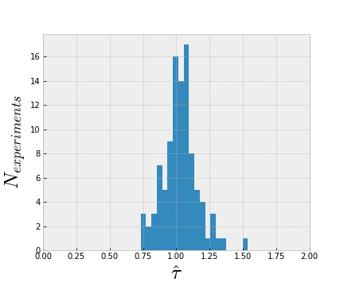
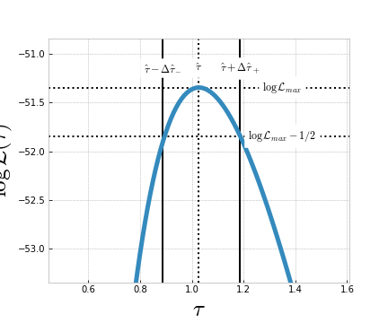
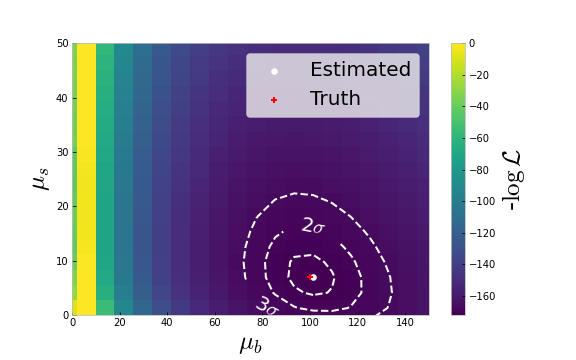

# PHYS-F-482: Advance techniques in experimental physics

## Theory of Estimators 
Juan A. Aguilar, Pascal Vanlaer 

(Based on G. Cowan's lectures)

---

# Table of Content
* Introduction of estimator
* Properties
* Examples of estimators
* Likelihood method
* Variance of Estimators
* Extended Likelihood method
* Binned Lielihood method
  
---

# Parameter estimation
The parameters of a distribution are constants that characterize their shape:

$$ f(x; \theta) = \frac{1}{\theta}\exp^{-\frac{x}{\theta}}$$
where $x$ is a r.v. and $\theta$ is a *parameter*.

Suppose we have a sample of observed values $\vec{x} = (x_1,x_2, ...)$ following the $f(x;\theta)$ distribution. We want to some function of the data $\vec{x}$ that **estimates** the value of the parameter $\theta$. 

  $$\hat{\theta}(\vec{x})$$
 
We put a *hat* to say that this is an estimator. We sometimes called *estimator* to the function, and *estimate* to the value that comes out with particular data set.

---

# Properties of Estimators

Estimates of $\hat{\theta}(\vec{x})$ depend on the r.v. $\vec{x}$, therefore, estiamtes are also r.v. and they follow an specific *pdf* $g(\hat{\theta}; \theta)$ that generally depends on the true value $\theta$:


* The **bias** of an estimator is defined as: $b = E[\hat{\theta}] - \theta$
  * Average repeated measurements should tend to 0 bias
* The **variance** is $V[\hat{\theta}] = E[\hat{\theta}^2]- (E[\hat{\theta}])^2$
  * Small variance 

---
# Properties of Estimators
Another measure of the quality of an estimator is called the *MSE* (Mean Squared error):
$$MSE = E[(\hat{\theta}- \theta)^2] = E[(\hat{\theta} - E[\hat{\theta}])^2]+(E[\hat{\theta}-\theta])^2 = V[\hat{\theta}]-b^2$$

:point_right: Small bias and variance are in general conflicting criteria. An estimator is called optimal if its bias is 0 and the variance minimal. 

---
# Example of estimator I

* Parameter: $\mu = E[x]$

* Estimator: $\hat{\mu} = \frac{1}{n}\sum_{i = 1}^n x_i \equiv \bar{x}$ 

> **Bias**: $b = E[\hat{\mu}] - \mu = \frac{1}{n}E[x_1 + x_2 + ... + x_n] - \mu = \frac{1}{n}E[n\mu] -\mu = 0$ 
> 
> **Variance**: $V[\hat{\mu}] = V[\frac{1}{n}x_1 +  ... + \frac{1}{n}x_n] = \frac{1}{n^2}\left(V[x_1] +  ... + V[x_n]\right) = \frac{1}{n^2}(n\sigma^2) = \frac{\sigma^2}{n}$

---
# Example of estimator II

* Parameter: $\sigma^2 = V[x]$
* Estimator: $\hat{\sigma}^2 = \frac{1}{(n - 1)}\sum_{i = 1}^{n}(x_i - \bar{x})^2 \equiv s^2$

> **Bias**: $E[\hat{\sigma}^2] - \sigma^2 = 0$ (the factor $n-1$ makes it possible)
>
> **Variance**: $V[\hat{\sigma}^2] = \frac{1}{n}(\mu_4 - \frac{n-3}{n-1}\mu_2),$ where $\mu_k = \int (x-\mu)^k f(x) {\rm d}x$

--- 

# The Likelihood Function
Suppose a set of measurements $x_i$ each independent and identically distributed (i.i.d) ie, each follows a probability distribution $f(x;\vec{\theta})$ that depends on a set parameter $\vec{\theta}$. 

If we evaluate the function with the data obtained and regard it as a function of the parameters $\vec{\theta}$ this is called the **likelihood funcion**:

$$\mathcal{L}(\vec{\theta}) = f(\vec{x};\vec{\theta}) = \prod_{i=1}^n f(x_i;\vec{\theta})$$
where $x_i$ are constants

---

# The Maximum Likelihood Method

The likelihood function is a function of $\vec{\theta}$ if we choose a $\theta$ close to the true value, it is expected that the probabilities are high.  So we define the maximum likelihood (ML) estimators to be the parameters that maximize the likelihood. If the likelihood function is differentiable the estiamtors are given by:

$$ \frac{\partial \mathcal{L}}{\partial \theta_i} = 0$$
---
# ML method: Example I

Consider the decay time of a particle, which is given by the exponential *pdf* $f(t; \tau) = \frac{1}{\tau}e^{-{t/\tau}}$ where $\tau$ is the lifetime of the particle. 
Imagine we have a set of measurements for different decays $t_1, ..., t_n$, the likelihood would be:
$$\mathcal{L}(\tau) = \prod_{i =1 }^n \frac{1}{\tau}e^{-\frac{t_i}{\tau}}$$

The value of $\tau$ for which $\mathcal{L}(\tau)$ is maximum also gives the maximum value of its logarithm (the log-likelihood function):

$$\log \mathcal{L}(\tau)  = \sum_{i =1 }^n \log \frac{1}{\tau}e^{-\frac{t_i}{\tau}}  = \sum_{i =1 }^n \left(\log{\frac{1}{n}} - \frac{t_i}{\tau}\right)$$


---

# ML method: Example I

Finding the maximum $\frac{\partial \log \mathcal{L}(\tau)}{\partial\tau} = 0$ gives:
$$ \hat{\tau} = \frac{1}{n}\sum_{i=1}^n t_i$$


```python
%matplotlib inline
import numpy as np
import scipy as sp
from scipy import special
from scipy.stats import expon

import matplotlib.pylab as plt

from IPython.display import Markdown
```
---
# ML method: Example I
```python
def exp(x, tau):
    return 1/tau * np.exp(x/tau)
tau  = 1.

x = np.linspace(0, 10, 1000)
y = exp(x, tau)

nevents = 50
data = np.random.exponential(tau, nevents)

fig, ax = plt.subplots(figsize=(8,6)) 
ax.scatter(data, np.zeros(nevents), s = 500, marker = '|') 
ax.plot(x, expon(0,tau).pdf(x), lw=2, color="red")
ax.set_xlim(0,5)
ax.set_ylim(0,1)
```
---
# ML method: Example I

```python
tau_estimate =  1./nevents * np.sum(data)
```
Best estimate is $\hat{\tau} = 1.01$

---
# ML method: Example II

Let's consider the case of a gaussian distribution:
$$f(x;\mu, \sigma^2) = \frac{1}{\sqrt{2\pi\sigma^2}} e^{-(x-\mu)^2/2\sigma^2}$$
If we have $x_1,...,x_n$ independent randon variables that follow the gaussian distribution,the log-likelihood is given by:
$$\log \mathcal{L}(\mu, \sigma^2) = \sum_{i=1}^n \log f(x_i;\mu,\sigma^2) = \sum_{i=1}\left(\log\frac{1}{\sqrt{2\pi}}+ \frac{1}{2}\log\frac{1}{\sigma^2}- \frac{(x_i - \mu)^2}{2\sigma^2}\right)$$
---
# ML method: Example II

Calculating the derivatives for $\mu$ and $\sigma^2$ we have:
$$\hat{\mu} = \frac{1}{n}\sum_{i=1}^n x_i$$
and
$$\hat{\sigma^2}= \frac{1}{n}\sum_{i=1}^n(x_i- \mu)^2$$
---
# ML method: Example II

* The estimator for $\mu$ is unbiased, but we find that $E[\hat{\sigma^2}] = \frac{n - 1}{n}\sigma^2$, so the ML estiamtor for $\sigma^2$ has a bias, that disappears when $n \rightarrow \infty$.
* To have an unbiased estimator we can use:
  $$ s^2 = \frac{1}{n - 1}\sum_{i=1}^n(x_i- \mu)^2$$
---
# Variance of Estimators

Once we have defined the estimators, we want to report its _statistical error_. I.e., how widely the estimate will distribute if we repeat the measurement many times. We are going to see 4 methods:
1. Analytical (when possible)
2. Monte Carlo method
3. Using the information inequality
4. Graphical Method

---

# Variance of Estimators: Analytical 

In some cases we can calculate the variance analytically. For example for the exponential distribution.
* We found the estimator as:  $\hat{\tau} = \frac{1}{n}\sum_{i=1}^n t_i$
* Variance is defined as: $V[\hat{\tau}] = E[\hat{\tau^2}] - (E[\hat{\tau}])^2$

$$=\int...\int\left(\frac{1}{n}\sum_{i=1}^n t_i\right)^2\frac{1}{\tau}e^{-t_1/\tau}...\frac{1}{\tau}e^{-t_n/\tau} {\rm d}t_1...{\rm d}t_n - \left(\int...\int\left(\frac{1}{n}\sum_{i=1}^n t_i\right)\frac{1}{\tau}e^{-t_1/\tau}...\frac{1}{\tau}e^{-t_n/\tau} {\rm d}t_1...{\rm d}t_n\right)^2$$
$$= \frac{\tau^2}{n}$$
* Note that the variance depends on $\tau$ the __true value__. In practice we take $\hat{\tau}$ as the value for the variance. In our example with 50 events we have:  $\hat{\sigma}_{\hat{\tau}} = \sqrt{V[\hat{\tau}]} = \sqrt{\hat{\tau}^2/n} = 0.15$

---
# Variance of Estimators: Monte Carlo

In several cases, we cannot calcualte the variance analytically. In those cases we can use a Monte Carlo method:

```python
nexperiments = 100
tau_estimates = []
for i in range(0, nexperiments):
   data = np.random.exponential(tau_estimate, nevents)tau_estimates.append(1./nevents * np.sum(data))
```
:point_right: Note that we used $\hat{\tau}$ to generate the pseudo-samples since we don't have access to the true $\tau$.

---
# Variance of Estimators: Monte Carlo


We obtained a standard deviation of $\hat{\sigma}_{\hat{\tau}} = 0.14$. 

---
# Variance of Estimators: The Rao-Cramer-Frechet Limit

The _information inequality_ (RCF) sets a lower bound on the variance of any estimator:

$$V[\hat{\theta}] \geq \frac{\left(1+\frac{\partial b}{\partial \theta}\right)^2}{E\left[-\frac{\partial^2 \log \mathcal{L}}{\partial \theta^2}\right]}$$
This is the **Minimum Variance Bound**, where $b$ is the bias $(b = E[\hat{\theta} - \theta])$. For unbiased estimatos we have the Cramer-Rao bound:
$$V[\hat{\theta}] \geq  \frac{1}{E\left[-\frac{\partial^2 \log \mathcal{L}}{\partial \theta^2}\right]} = \frac{1}{\mathcal{I}(\theta)}$$

where $\mathcal{I}(\theta) = - E\left[\frac{\partial^2 \log \mathcal{L}}{\partial \theta^2}\right]$ is the **Fisher information**.

---
# Variance of Estimators: The Rao-Cramer-Frechet Limit

For the case of more parameters $\vec{\theta} = (\theta_1,...\theta_n)$, the covariance matrix of their estimators, $V_{ij}$ is given by:
$$(V^{-1})_{ij} = E\left[-\frac{\partial^2\log\mathcal{L}}{\partial\theta_i\partial\theta_j}\right] $$
It is impractical, in many instances, to calculate the RCF bound instead we can estimate it as:

$$(\widehat{V^{-1}})_{ij} = -\frac{\partial^2\log\mathcal{L}}{\partial\theta_i\partial\theta_j}\Bigr|_{\vec{\theta}=\hat{\vec{\theta}}} $$

and for one parameter:

$$\widehat{\sigma^2_{\hat{\theta}}} = \left(-1\Bigr/\frac{\partial^2\log\mathcal{L}}{\partial\theta^2}\right)\Bigr|_{\theta=\hat{\theta}} $$


---

# Variance of Estimators: The Graphic Method

The graphic method is consists on evaluating the shape of the likelihood around its minuma (we saw this in BAC3 labs). For that we can expand in as Taylor expansion:

$$\log {\mathcal{L}(\theta)} = \log {\mathcal{L}(\hat{\theta})} + \left[\frac{\partial \log \mathcal{L}}{\partial \theta}\right]_{\theta = \hat{\theta}}(\theta - \hat{\theta}) + \frac{1}{2}\left[\frac{\partial^2 \log \mathcal{L}}{\partial \theta^2}\right]_{\theta = \hat{\theta}}(\theta - \hat{\theta})^2 + ...$$
By definition $\log {\mathcal{L}(\hat{\theta})} = \log \mathcal{L}_{max}$. Also the first derivative is 0, since it's evaluted at its maximum so:
 $$ \log {\mathcal{L}(\theta)} = \log \mathcal{L}_{max} - \frac{(\theta - \hat{\theta})^2}{2 \widehat{\sigma_{\widehat{\theta}}^2}}$$
or 
  $$\log \mathcal{L}(\theta \pm \widehat{\sigma_{\hat{\theta}}}) =\log \mathcal{L}_{max} - \frac{1}{2}$$ 
---
# Variance of Estimators: The Graphic Method

 
In this case: $\Delta \hat{\tau}_+ = 0.16$ and  $\Delta \hat{\tau}_- = 0.14 \rightarrow \hat{\sigma}_{\hat{\tau}} \approx 0.15$

---

# Variance of Estimators: Gaussian approximation
The M.L. estimate, $\hat{\theta}$, depends on randomly distributed variables, $x_1,...,x_n$, therefore it also a *random variable*. Since it depends on a large number of random variables, the **Central Limit Theorem** says that $\hat{\theta}$ should follow a gaussian distribution with the true, $\theta$, as central value:
$$\mathcal{L}(\hat{\theta})=\frac{1}{\sqrt{2\pi\sigma^2_\hat{\theta}}}e^{-\frac{1}{2}\frac{(\theta-\hat{\theta})^2}{\sigma^2_\hat{\theta}}}$$
or in $\log$:

$$\log \mathcal{L}(\hat{\theta})= -\frac{1}{2}\frac{(\theta-\hat{\theta})^2}{\sigma^2_\hat{\theta}} - \frac{1}{2}\log(2\pi\sigma^2_\hat{\theta}) $$

which is similar to the result we obteined with the Taylor expansion.

---

# Variance of Estimators: Two correlated estimates

If we have different estimates, $\hat{\theta}_1, \hat{\theta}_2$ that are correlated. For large $n$, the likelihood takes the gaussian approximation:

$$\log \mathcal{L}(\hat{\theta}_1, \hat{\theta}_2) \approx \frac{1}{\sqrt{1-\rho^2}} \frac{1}{2\pi\sqrt{\sigma^2_\hat{\theta_1}\sigma^2_\hat{\theta_2}}}e^{-\frac{1}{2(1-\rho^2)}\frac{(\theta_1-\hat{\theta}_1)^2}{\sigma^2_\hat{\theta_1}}\frac{(\theta_2-\hat{\theta_2})^2}{\sigma^2_\hat{\theta_2}}-2\rho\frac{(\theta_1-\hat{\theta}_1)}{\sigma_\hat{\theta_1}}\frac{(\theta_2-\hat{\theta}_2)}{\sigma_\hat{\theta_1}}}$$

The $\log \mathcal{L}$ then takes a quadratic form near maximum which is a paraboloid centered at $\hat{\theta}_1, \hat{\theta}_2$ in the $\theta_1, \theta_2$ space. 

---
# Variance of Estimators: Two correlated estimates
The contour $\log \mathcal{L} (\hat{\theta}_1, \hat{\theta}_2) = \log \mathcal{L}_{max} - 1/2$ is an ellipse:


---

# Variance of Estimators: Two correlated estimates
The angle of the ellipse, $\phi$ is given by:
$$\tan 2\phi = \frac{2\rho\hat{\sigma}_{\theta_1}\hat{\sigma}_{\theta_2}}{\hat{\sigma}^2_{\theta_1} - \hat{\sigma}^2_{\theta_1}}$$

Correlations between estimators result in an increase of their standard deviations. 

---

# Functions of ML estimators

Let's come back to the decay of a particle, imagine we wrote it as function of the decay constant $\lambda = \frac{1}{\tau}$:
$$f(t;\lambda) = \lambda e^{-\lambda t}$$

* The ML estimator of a function is simply $\hat{\alpha}(\theta) = \alpha(\hat{\theta})$ in this case:
  $$ \hat{\lambda} = \frac{n}{\sum_{i=1}^n t_i}$$
* There is a caveat: $\hat{\lambda}$ is biased:
  $$ E[\hat{\lambda}]= \lambda \frac{n}{n-1}$$ 
  (bias goes to 0 when $n\rightarrow \infty$)

---

# Extended Maximum Likelihood Method
Sometimes the total number of events in a sample is a fixed number, sometimes, $n$ is also a random variable. 

> Example 1: For the muon life time, you can decide to run you experiment until you always get $n$ number of triggers, since you only care about the $\Delta t$. 
> Example 2: You look for a rare physics event (like a desintegration) and you measure the number of events $n$ in fixed time window.

---

# Extended Maximum Likelihood Method

In this cases, $n$ will be often a Poisson random variable with mean $\nu$. The results of an experiment will be: $n$, $x_1$, ... $x_n$.

The extended likelihood is defined as:

$$\mathcal{L}(n, \vec{\theta}) = \frac{\nu^n}{n!}e^{-\nu}
\prod_{i=1}^nf(x_i;\vec{\theta})$$

We have now 2 options:
1. The expected number of events denpends on the unknown parameters $\vec{\theta}$, i.e. $\nu = \nu(\vec{\theta})$.
2. The two, $\nu$ and $\vec{\theta}$ are independent.

---
# Extended Maximum Likelihood Method
Suppose theory gived $\nu = \nu(\vec{\theta})$ then the log-likelihood can be written as:
$$\log {\mathcal{L}(\vec{\theta})} = -\nu(\vec{\theta}) + \sum_{i=1}^n \log (\nu(\vec{\theta})f(x_i;\vec{\theta})) + C $$

> Example: A process where the number of events depends on the cross-section $\sigma(\vec{\theta})$ predicted as function of the parameters of the theory, $\vec{\theta}$ that also dictate the shape of the distribution of events $x_i$.


---

# Extended Maximum Likelihood Method

In case $\nu$ and $\vec{\theta}$ are independent we can find the estimator $\widehat{\vec{\theta}}$ by maximizing ($\partial/\partial\vec{\theta}$):

$$\log {\mathcal{L}(\vec{\theta})} = n\log \nu -\nu + \sum_{i=1}^n \log f(x_i;\vec{\theta}) + C $$

likewise the estimator $\hat{\nu}$ can be find by maximizing over $\nu$:
$$\frac{\partial \log {\mathcal{L}(\vec{\theta})}}{\partial \nu} = 0 = \frac{n}{\nu} - 1 \rightarrow \hat
{\nu} = n$$ 
---
# Extended Maximum Likelihood: Example
Let's assume a sample mixed with two types of events, a signal that follows a known distribution $f_s(x)$ and background events distributed as $f_b(x)$. We defined:
* signal fraction $= \theta$.
* expected number of events $= \nu$.
* observed number of events $= n$.
* expected number of signal events $\mu_s= \theta \nu$
* expected number of background events $\mu_b = (1-\theta)\nu$

The goal is to estimate $\mu_s$ and $\mu_b$. The overall dsitribution of events can be defined as:

$$f(x; \mu_s, \mu_b) = \frac{\mu_s}{\mu_s + \mu_b}f_s(x)+\frac{\mu_b}{\mu_s + \mu_b}f_b(x)$$

---
# Extended Maximum Likelihood: Example
The observed number of events will follow a Poisson distribution as:
$$P(n; \mu_s,\mu_b) = \frac{(\mu_s + \mu_b)^n}{n!}e^{-(\mu_s + \mu_b)}$$
The likelihood can be written as:

$$\log \mathcal{L}(\mu_s,\mu_b) = - (\mu_s + \mu_b) +\sum_{i= 1}^n\log[(\mu_s + \mu_b)f(x_i;\mu_s, \mu_b)]$$

which becomes:

$$\log \mathcal{L}(\mu_s,\mu_b) = - (\mu_s + \mu_b) +\sum_{i= 1}^n\log[\mu_s f_s(x_i) + \mu_b f_b(x_i)]$$


---

# Extended Maximum Likelihood: Example

Let's generate a sample of with defined distributions for background and signal
```python
tau = 3
bg_events = 100
background = np.random.exponential(tau, bg_events)
sig_events = 7
mu = 1.5
sigma = 0.1
signal = np.random.normal(mu, sigma, sig_events)

ntotal = bg_events + sig_events

from argparse import Namespace

truth = Namespace(mu_s = sig_events, mu_b = bg_events)

print (truth)
```
We have a true values $\mu_s = 7$ and $\mu_b = 100$.

---

# Extended Maximum Likelihood: Example

We can plot the sample and the distributions as:


---
# Extended Maximum Likelihood: Example

We can now define the $-\log{\mathcal{L}}$ and find its minima:

```python

def likelihood(mu_s, mu_b):
    values = np.log(mu_s * norm(mu, sigma).pdf(sample) + mu_b * expon(0, tau).pdf(sample))
    return (mu_s + mu_b) - np.sum(values)
```

---
# Extended Maximum Likelihood: Example

For one specific MC sample we find the best estimates:


$\hat{\mu}_s = 6.9, \hat{\mu}_b =101.3$ with errors given by the countours. 

---
# Extended Maximum Likelihood: Example

* Sometimes a downgoing fluctuation of the background in the signal region can result in a *negative* signal estimate $\hat{\mu}_s$. 
* We can let that happen as long as the total *pdf* $f(x; \hat{\mu}_s, \hat{\mu}_b) > 0$, i.e. remains positive everywhere.


---

# Binned Maximum Likelihood
* When data is large, using the individual events might be very CPU consuming. In this case it is better to use histrograms. 
* The number if events in the bin-$i$ based on the unknown parameters, $\vec{\theta}$ is:
  $$\nu(\vec{\theta})_i = n_{tot}\int_{x^i_{min}}^{x^i_{max}}f(x;\vec{\theta}){\rm d}x$$ 
  where $x^i_{min}$, $x^i_{max}$ are the limits of the bin. 
* So we have a vector $\vec{\nu}=(\nu_1,... \nu_N)$ of $N$ bins of expected values per fin, plus a vector $\vec{n} = (n_1, ... n_N)$ of measured content per bin
 
---

# Binned Maximum Likelihood II

* We can model data as a multinominal distribution:
  $$ f(\vec{n}, \vec{\nu}) = \frac{n_{tot}!}{n_1!... n_N!}\left(\frac{\nu_1}{n_{tot}}\right)^{n_1} ...\left(\frac{\nu_N}{n_{tot}}\right)^{n_N}$$
* where the probability of falling in a bin is given by $\nu_i/n_{tot}$. 
* The log-likelihood is given by:
  $$ \log \mathcal{L}(\vec{\theta}) = \sum_{i=1}^N n_i\log \nu_i(\vec{\theta}) + C $$

---

# Binned Maximum Likelihood III

Same example as before. 

```python
content, bins, patches = ax.hist(data, bins=np.linspace(0, 5, 10)) 
ax.plot(x, nevents*(bins[1] - bins[0])*expon(0,tau).pdf(x), lw=2, color="red")
ax.set_xlim(0,5)
ax.set_xlabel("$t$")
ax.set_ylabel("$y$")
```


---

# Binned Maximum Likelihood III

```python

def binllh(tau):
    nus = np.array([ nevents * (expon(0, tau).cdf(bins[i+1]) 
    - expon(0, tau).cdf(bins[i])) for i,b in enumerate(bins[:-1])])
    values = np.sum(content * np.log(nus))
    return values

```

* Doing the unbinned estimator we find: $\hat{\tau} = 0.99$

* Doing with a binned data: $\hat{\tau} = 0.98$

In the limit of very small bins, we usually recover the unbinned likelihood. 

---

# Relation of ML and $\chi^2$

If the parameters, (measurements) are correlated, in the large sample limit the likelihood function is a n-dimensional Gaussian with covariance $V$

$$\mathcal{L}(\hat{\vec{\theta}};\vec{\theta}, V)= \frac{1}{(2\pi)^{N/2}|V|^{1/2}}e^{[-\frac{1}{2}(\hat{\vec{\theta}} - \vec{\theta})^TV^{-1}(\hat{\vec{\theta}} - \vec{\theta})]}$$

The loglikelihood becomes:
$$\log \mathcal{L}(\hat{\vec{\theta}}) = -\frac{1}{2}\sum_{i,j = 1}^N [-\frac{1}{2}(\hat{{\theta}_i} - {\theta}_i)^T (V^{-1})_{ij}(\hat{{\theta}_j} - {\theta}_j)] + {\rm cte}$$
Which maximizes when we minimize:
$$ \chi^2(\vec{\theta}) = \sum_{i,j = 1}^N (\hat{{\theta}_i} - {\theta}_i)^T (V^{-1})_{ij}(\hat{{\theta}_j} - {\theta}_j) $$

---
# Relation of ML and $\chi^2$
If the covariance is diagonal, ie, the parameters are not correlated:

$$\chi^2(\vec{\theta}) = \sum_{i}^N \frac{(\hat{\theta}_i - \theta_i)^2}{\sigma^2_{\theta_i}} $$

* The parameters $\hat{\theta}_i$ that minimize this equation are called **Least Squared** (LS) estimators.  

*  If $\hat{\theta}_i$ are gaussian distributed, the value of $\chi^2_{min}$ is also a random variable of addition of gaussian numbers which follows the $\chi^2$ distribution, $f_{\chi^2}(\chi^2;n_d)$.
*  $n_d$ is the degrees of freedom:
  $$ n_d = \rm{number\; of\; point} - \rm{number\; of\; fitted\;parameters} $$

---

# LS and Goodness-of-fit

* The expectatino value of $f_{\chi^2}(\chi^2,n_d)$ is $n_d$. So if $\chi^2_{min} \approx n_d$ we say the fit is good.
* More correctly we need to calculate the $p$-value:
  $$ p = \int_{\chi^2_{min}}^{\infty}f_{\chi^2}(t;n_d){\rm d}t$$

* This is the probability of obtaining a $\chi^2_{min}$ as high as the one we got, or higher, if the hypothesis is correct.
  

---

# Summary

We have seen:
* Estimators and its properties (consistent, unbias and efficient)
* Maximum Likelihood estimates
* Variance of Estimators:
  *   Analytical, Monte Carlo, Graphical, Cramer-Rao,..
* Extendended Likihood
* Binned Likelihood method
 